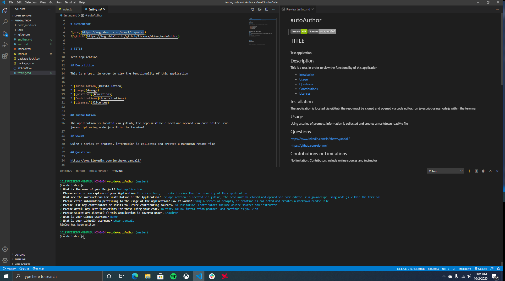

# autoAuthor

# TITLE

Auto Author

## Description

This application removes the hassle of having to create your own markdown readMe file! With just a few easy to answer questions, your readMe is complete!

## Installation

Clone the Repository located here:

Open via Code editor, and run javascript file within your terminal. Using node.js, execute the file.

## Usage

Purpose of this application is to create a markdown readMe file.
Following installation procedure, you are then prompted with a series of questions. The answers are then used to populate and create a new READme file using markdown language.

## Questions

https://www.linkedin.com/in/shawn.yandall/

https://github.com/dohmr/

## Contributions or Limitations

The use of online sources. 

NPM packages and modules; Inquirer

Instructor tutorials and direction.


## Licenses


Inquirer module


## Screens



Open index.js in Integrated Terminal.

Using node.js , run index.js
```
-node index.js
```
